<p align="center"><a href="https://laravel.com" target="_blank"></a></p>

# Ultras - Laravel Ecommerce Project

Ultras is a full-featured online shopping platform built using the Laravel framework. It includes essential ecommerce functionalities such as product management, category and variation handling, user authentication, shopping cart, and order processing. The system is designed with a responsive user interface and secure backend, providing a smooth shopping experience for customers and an efficient management dashboard for administrators.

---

## Features

- Role-based user registration and authentication system
- Product and category management
- Product variations
- Shopping cart functionality
- Order management system
- Admin dashboard for store control
- Secure checkout process
- Responsive and user-friendly design

---

## Tech Stack

- Laravel  
- PHP  
- MySQL  
- Blade  
- Tailwind  
- JavaScript 

---

## Installation

Clone the repository

```bash
git clone https://github.com/alnoman30/Ultras-Ecommerce-Fullstack-Laravel.git

cd Ultras-Ecommerce-Fullstack-Laravel

composer install
npm install

cp .env.example .env

php artisan key:generate

php artisan migrate

php artisan db:seed

php artisan serve

```

## Admin login access
Email: admin@example.com
Password: 12345678

---

## Screenshots
## Website

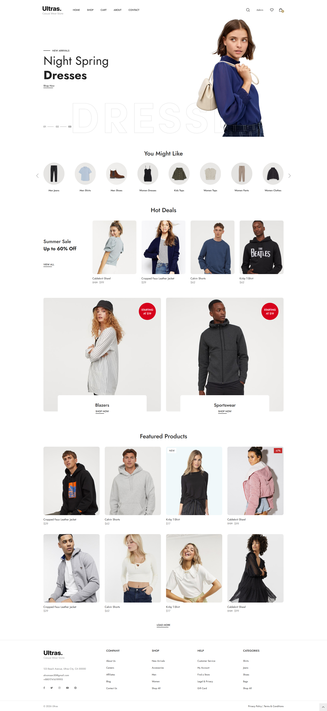
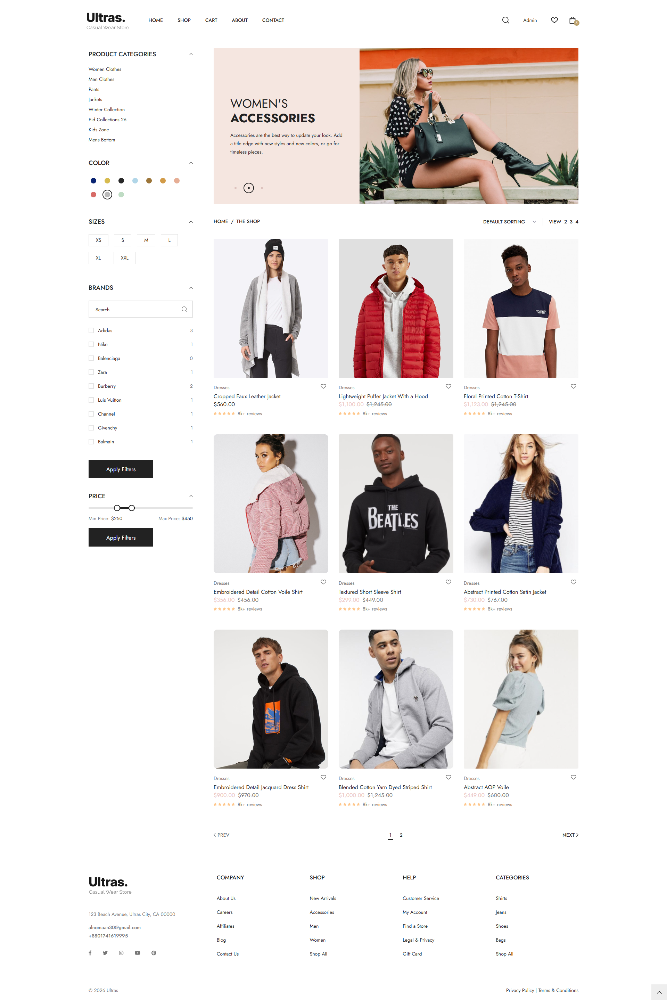
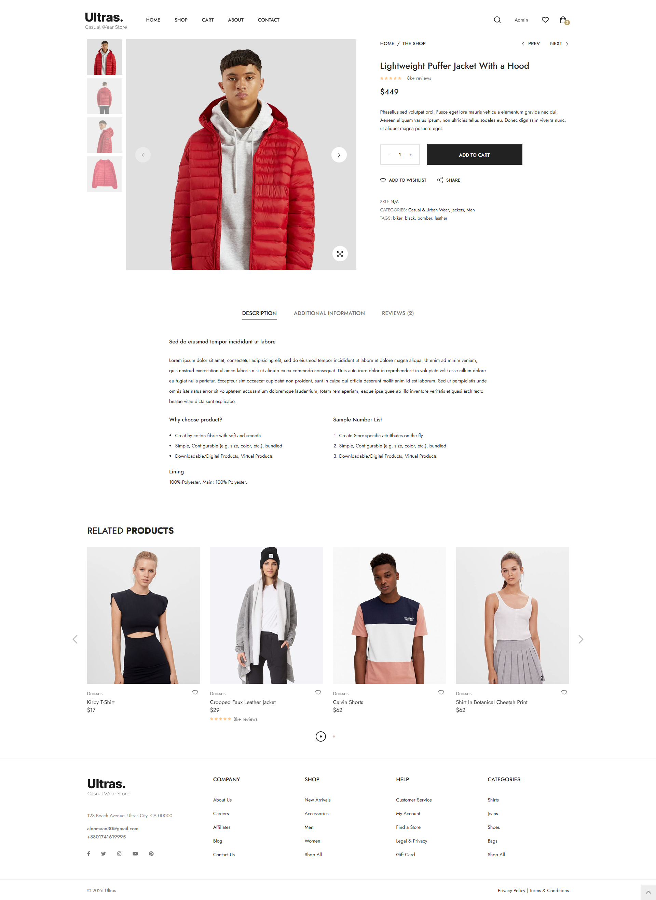
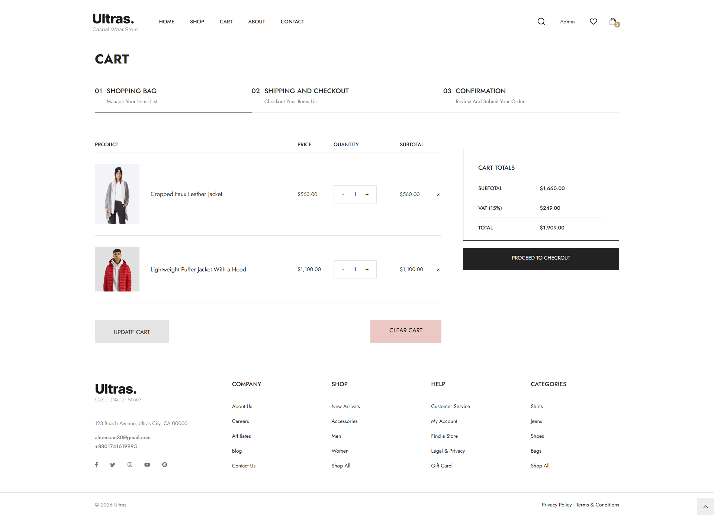

## Admin Panel
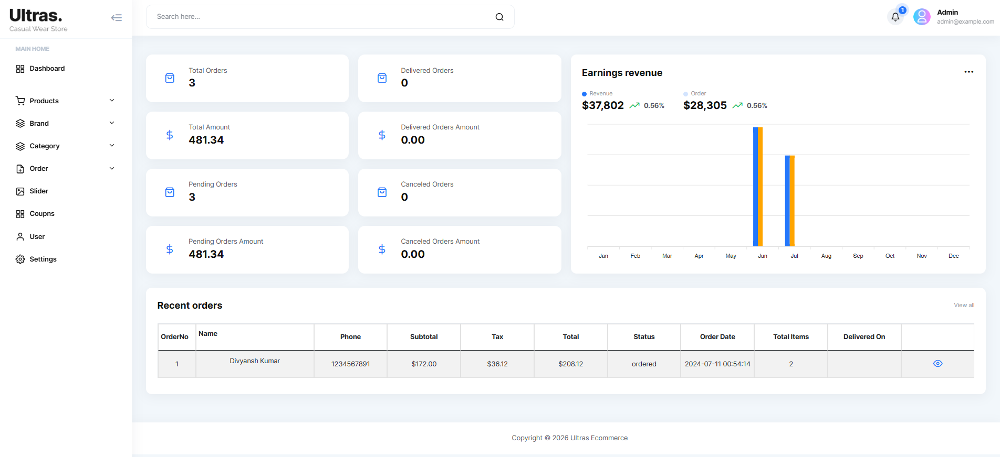
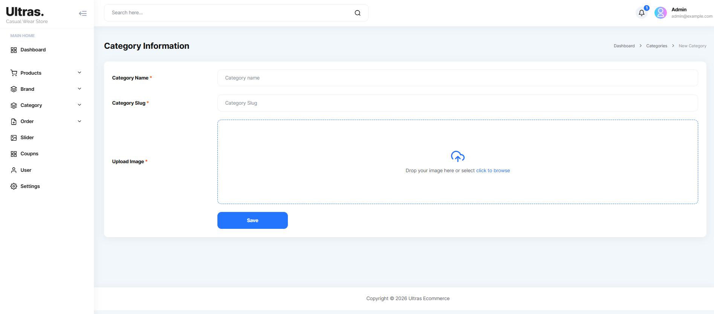
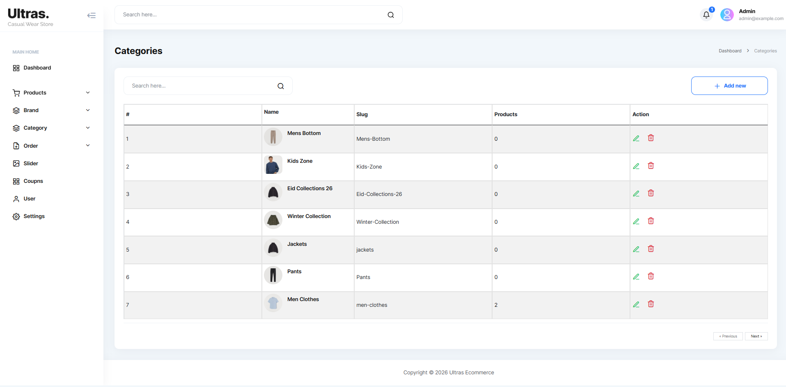
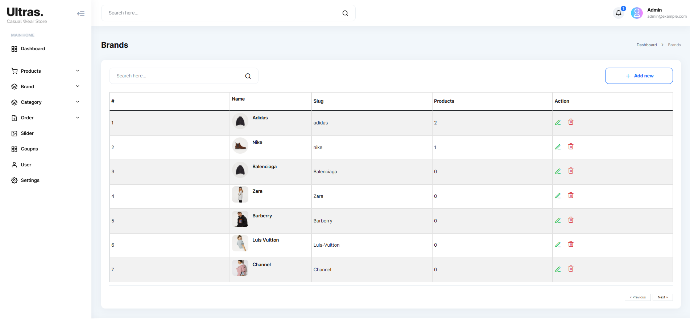
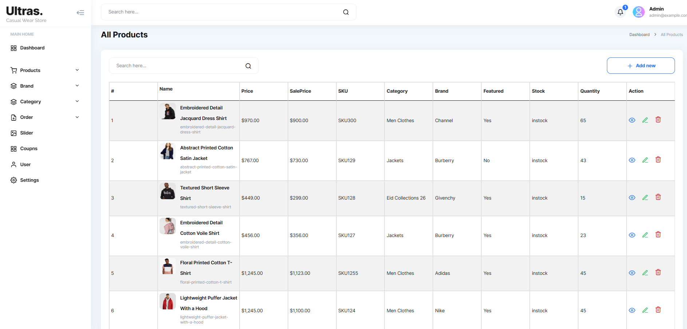
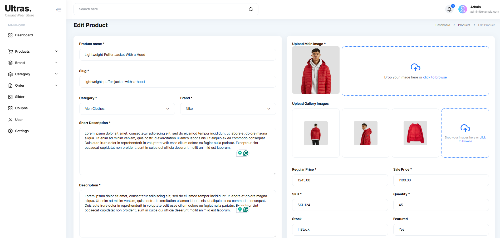
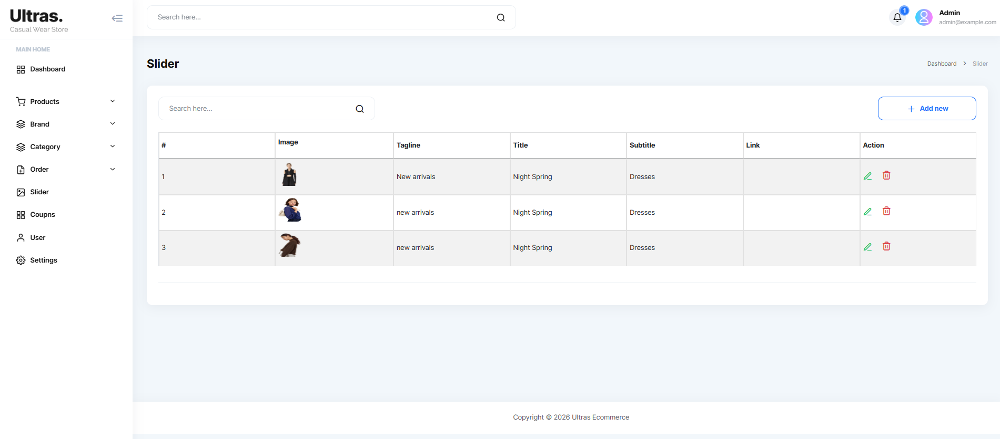

---

```markdown
## Author

**Abdullah Al Noman**

GitHub: https://github.com/alnoman30
Instagram:https://www.instagram.com/noman.hehe/

